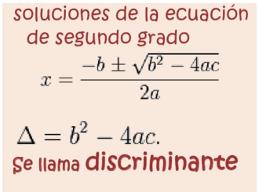
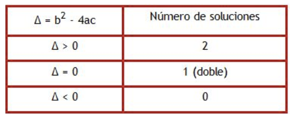

# Examen

1- Desarrolle un algoritmo que permita leer tres valores desde el teclado y entregue como resultado cuál es el mayor y cuál es el menor valor. En caso que los tres números sean iguales, el algoritmo debe mostrar un mensaje informando que los tres números son iguales.

2- La solución de una ecuación de segundo grado está dada por la fórmula:

Donde a, b y c son números conocidos y con ellos se calcula el resultado. Se debe tener en consideración que el discriminante, nos indica si la ecuación tiene dos soluciones, una única solución o no tiene solución, de acuerdo a la siguiente formula:

Desarrolle un algoritmo en pseudocódigo que permita recibir los valores de a, b y c. Como resultado se mostrará la solución(es) de la ecuación, en caso de que existan, y un mensaje de que no tiene solución en caso contrario. Recuerda que para saber si la ecuación tiene o no solución debes evaluar el discriminante.

3- Para calcular el promedio final de la asignatura de Fundamentos de Programación, se tiene la siguiente formula, la EPE1 equivale a un 10% de la nota final, la EPE2 al 20%, EPE3 al 30%, EVA1 un 10%, la EVA2 10% y la EVA3 20%. Desarrolla un Algoritmo en pseudocódigo que reciba como entrada la cantidad de estudiantes del curso, por cada uno de ellos recibirás cada una de las notas antes mencionadas y entregarás como resultado el promedio final del curso.